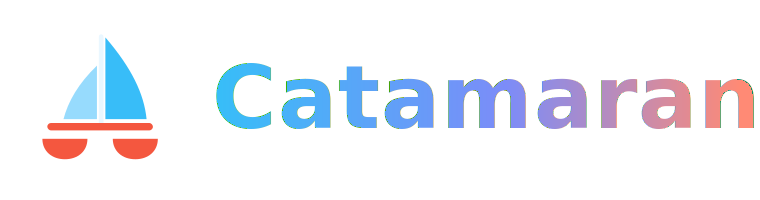

<p align="center">
  
</p>

<h3 align="center">Two hulls. One helm.</h3>

<p align="center">
  A fast, beautiful Kubernetes workspace for the desktop, built on <a href="https://v2.tauri.app">Tauri v2</a>
  with a pure-Rust core. Its signature move is the <strong>split-screen deck</strong>: open two cluster
  contexts side by side — compare prod against staging, or tail live logs from two pods at once —
  and every backend capability doubles as an <a href="https://modelcontextprotocol.io">MCP</a> tool
  so AI agents can sail the same routes as the UI.
</p>

<p align="center">
  <a href="#quick-start">Quick start</a> ·
  <a href="#split-view">Split View</a> ·
  <a href="#mcp-server">MCP server</a> ·
  <a href="docs/INSTALL.md">Install</a> ·
  <a href="docs/DEVELOPMENT.md">Developer guide</a> ·
  <a href="CONTRIBUTING.md">Contributing</a>
</p>

<p align="center">
  <a href="https://github.com/dev-tuskira/catamaran/releases/latest"></a>
  <a href="LICENSE"></a>
  
  
  
</p>

---

## Why Catamaran?

A catamaran is one vessel with two parallel hulls — faster, more stable, and impossible to
capsize by leaning on one side. That's the product idea in a sentence: **operating Kubernetes
is usually a two-cluster problem** (dev vs prod, blue vs green, old vs new), and single-pane
tools make you juggle windows to see both.

| | Catamaran | Electron-era Kubernetes IDEs |
|---|---|---|
| **Split-screen contexts** | Two independent panes, each with its own context, namespace, tabs, and log dock | One cluster at a time |
| **Rendering** | OS system WebView via Tauri v2 | Bundled Chromium in every install |
| **Core runtime** | Pure Rust (`kube-rs`, `tokio`) — no Node.js | Node.js main process |
| **Cluster access** | Direct to the API server via `kube-rs` | Bundled `kubectl`/`helm` behind a proxy layer |
| **AI agents** | Built-in MCP server, every capability exposed | — |

## Split View

Press <kbd>⌘\</kbd> (or use the deck switch in the top bar) to split the workspace into two
panes. Each pane is a full workspace with its own cluster context, namespace filter, resource
tabs, and bottom dock:

- **Compare environments** — open `prod` on the port side and `staging` on the starboard side
  and walk the same resources in both.
- **Race two log streams** — tail a pod in each pane, side by side, live.
- **Linked cruising** — enable *Link panes* and both panes navigate together: switch the
  resource kind or namespace in one and the other follows, so diffing environments is one
  gesture instead of two.

The focused pane carries the tiller: the sidebar, command palette, and cluster switcher all
act on it, and a subtle brand-colored indicator shows which pane is live.

## Features

- **Multi-cluster workspace** — kubeconfig discovery (including additional files and pasted
  configs), context switching, per-context avatars and colors, cluster rail.
- **Live resource browsing** — 40+ resource kinds across workloads, networking, storage, RBAC,
  and CRDs, with server-side watches streaming into the UI — no polling.
- **Resource detail & YAML** — manifest view, schema-aware YAML editing (CodeMirror) with
  validation and apply, resource events, workload relations.
- **Operations** — scale, rollout restart, delete/evict pods, cordon/drain nodes, port-forward
  management — every destructive action gated behind confirmation.
- **Pod terminal & logs** — interactive `exec` sessions (xterm.js) and live log streaming with
  follow, previous-instance logs, timestamps, since/tail windows, and multi-container export.
- **Helm** — browse installed releases and inspect release details.
- **Metrics** — node and pod metrics (metrics-server) with usage overviews and sparklines.
- **Command palette** — <kbd>⌘K</kbd> keyboard-first navigation with frecency-ranked results
  and action commands, including Split View control.
- **Local-first** — talks directly to your API servers with your kubeconfig credentials. No
  cloud service in between.

## MCP server

The same binary that runs the GUI can run as an MCP server, exposing the full capability
registry:

```sh
# stdio transport (for local agents / IDE clients)
catamaran-desktop --mcp-stdio

# HTTP transport (loopback only, default 127.0.0.1:8765)
catamaran-desktop --mcp-http [addr]
```

Destructive tools (delete, drain, apply, …) carry annotations and require an explicit
`_confirm` argument — an agent can't delete or drain anything without approval.

Example MCP client config:

```json
{
  "mcpServers": {
    "catamaran": {
      "command": "/path/to/catamaran-desktop",
      "args": ["--mcp-stdio"]
    }
  }
}
```

## Quick start

Prerequisites: [Rust](https://rustup.rs) (stable), [Node.js](https://nodejs.org) 22+,
[pnpm](https://pnpm.io) 9+, and the
[Tauri v2 system dependencies](https://v2.tauri.app/start/prerequisites/) for your platform.

```sh
pnpm install
pnpm dev          # launches the desktop app with hot reload
```

Other useful commands:

```sh
pnpm test         # all JS/TS tests (Vitest, with coverage)
cargo test        # all Rust tests
pnpm build        # production frontend build
pnpm tauri build  # packaged desktop binaries (macOS .app + .dmg)
```

See the [developer guide](docs/DEVELOPMENT.md) for architecture, testing standards, and how
to add a new capability, and the [install guide](docs/INSTALL.md) for packaged builds.

## Repository layout

```
apps/desktop/            Tauri app
  src/                   React 19 + TypeScript UI (shadcn/radix, xterm, CodeMirror)
  src-tauri/             Rust backend: commands, streams, capability registration
crates/
  capability/            Capability registry — single source of truth for backend ops
  kube/                  Kubernetes integration (kubeconfig, watches, actions, helm, metrics)
  mcp/                   MCP server (stdio + HTTP) generated from the registry
docs/                    Project documentation + brand assets
```

## License

Catamaran is open source under the [MIT License](LICENSE). It began as a fork of an
MIT-licensed Kubernetes IDE and has since charted its own course; the original copyright
notice is preserved in [LICENSE](LICENSE) as the license requires.
